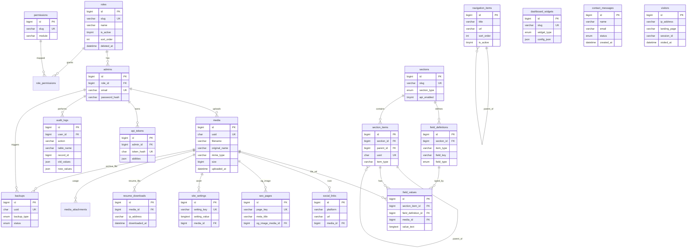
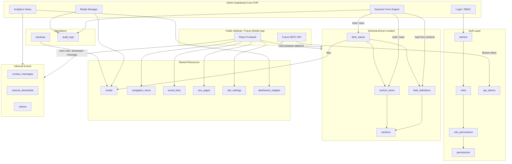

# Portfolio CMS — Database Design (Step 2 Revised)

## 1. ER Diagram



## 2. Database Flow Diagram



## 3. Dynamic Form Contract (Admin)

```
GET section by slug
  → field_definitions WHERE section_id AND is_active AND deleted_at IS NULL
  → ORDER BY item_type, sort_order

For each field_definition:
  field_type → HTML input:
    text/url/email/tel/number/color → <input>
    textarea/richtext               → <textarea>
    boolean                         → checkbox
    select/multiselect              → <select> from options_json
    image/file/pdf                  → media picker → stores media_id
    json/repeater                   → structured editor → value_text JSON

Save:
  upsert section_items + field_values
  write audit_logs(user_id, action, table_name, record_id, old_values, new_values, ...)
```

**Rule:** Adding a row to `field_definitions` must make the field appear in the admin form with **zero PHP form markup changes**.

## 4. Complete SQL Schema

File: [`schema.sql`](./schema.sql)

Includes:
- Full DDL (all tables, FKs, indexes)
- Sample seed data (roles, permissions, sections, field definitions, navigation, social, SEO, theme settings, widgets, sample profile values, sample contact message)

## 5. Seed Highlights

| Area | Seeded |
|---|---|
| Roles | `super_admin`, `editor`, `viewer` |
| Admin | `admin@example.com` (change password immediately) |
| Sections | profile, navbar, hero, about, skills, experience, education, projects, contact, footer |
| Field defs | Auto-form fields for all current frontend content |
| Navigation | Home → Contact anchors |
| Theme settings | primary/secondary color, logo, favicon, dark mode, maintenance, GA, GTM |
| Widgets | Visitors, downloads, unread messages, charts, top pages |
| Contact | 1 Unread sample message |

## 6. Index Coverage

Indexes exist for: `slug`, `created_at`, `media_id`, `section_id`, `section_item_id` (item_id), `downloaded_at`, `visited_at`, plus status/email/session/FK columns used in filters.
